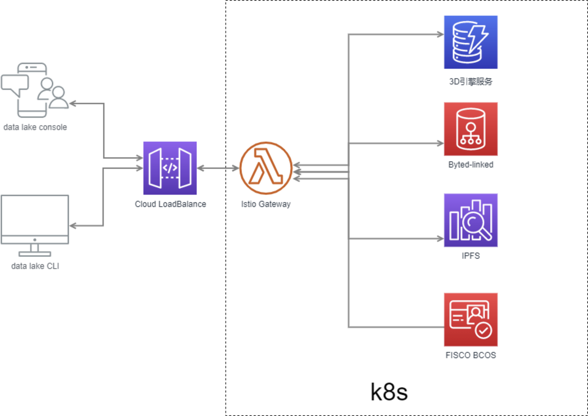

# bytes-linked

一个3D数字资产确权的NFT开源产品，对于NFT和元宇宙感兴趣的可以star和贡献，项目会持续更新。

## 🏄🏻产品视图

## 🔨技术架构

## 😉Author

bytes-linked 主要由以下几位开发者开发维护

* [@shikanon](https://github.com/shikanon)
* [@yovenchen](https://github.com/yovenchen)
* [@ClarkChu07](https://github.com/ClarkChu07)

## 📃License

MIT [©shikanon](https://github.com/shikanon)、[©ClarkChu07](https://github.com/ClarkChu07)、[©yovenchen](https://github.com/yovenchen)